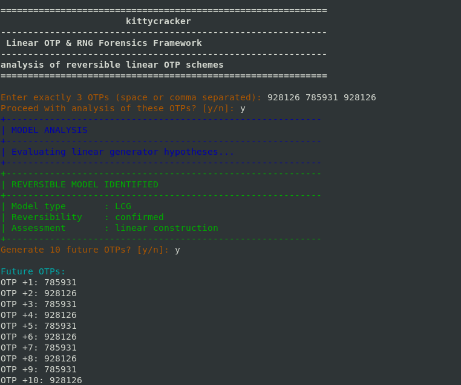

#   
# kittycracker

**Linear OTP & RNG Forensics Framework**  

> Research-grade tool for analyzing reversible linear OTP generators  

---

## Overview

kittycracker is a **research-focused framework** for analyzing observed One-Time Password (OTP) sequences.  
It is designed to detect **linear patterns** in OTP generators such as **LCG**, **Affine Counter**, and other linear constructions, and to predict possible future OTPs when reversible.  

---

## Screenshots


  


---

## Usage 

Enter exactly 3 OTPs

Confirm [y/n] to proceed with analysis

See detected model (if any)

Optionally, generate 10 future OTPs

---

## Notes

Strictly requires 3 OTPs as input

Only LCG and Affine Counter detection are fully implemented

---

## Installation

```bash
git clone https://github.com/<your-username>/kittycracker.git
cd kittycracker
chmod +x kittycracker.py
